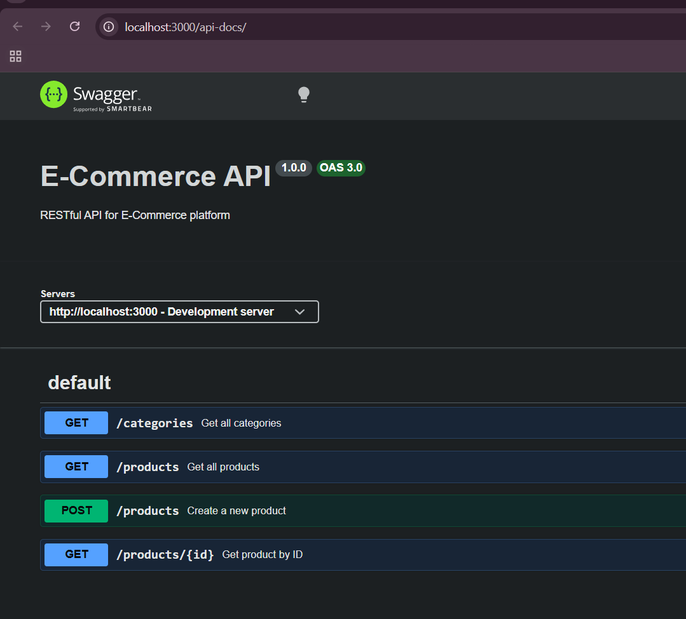
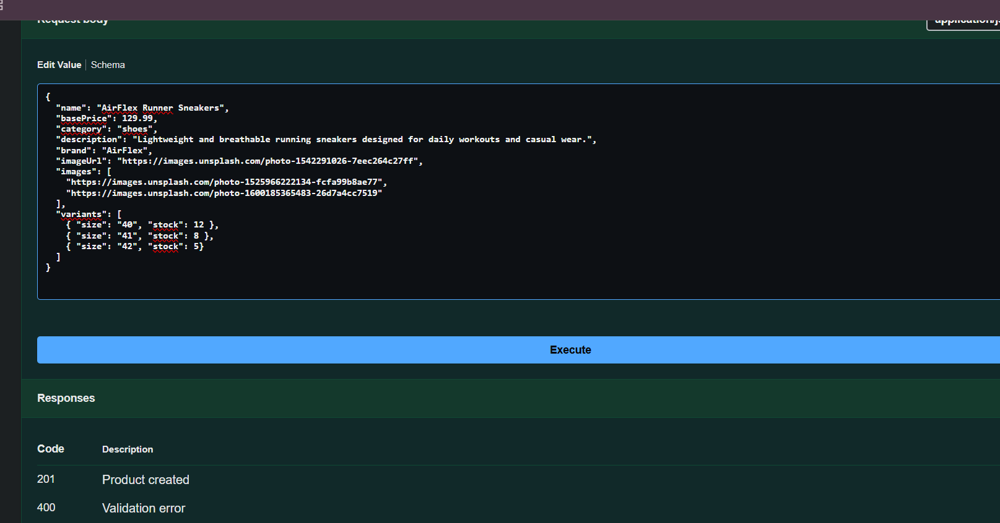
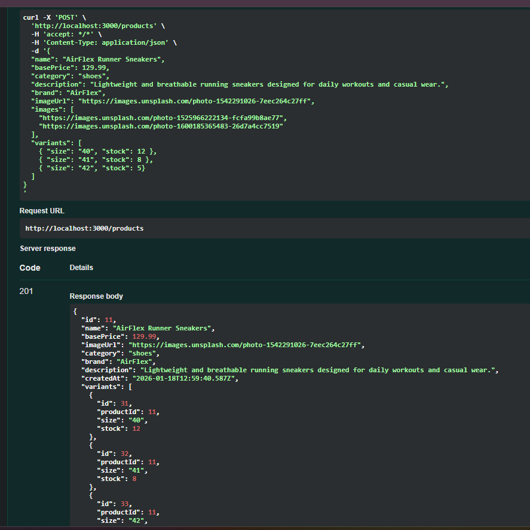

# E-Commerce Project

A full-stack e-commerce solution featuring a modern React frontend and a robust Node.js/Express backend.

## Overview
This project simulates a basic e-commerce platform where users can browse products, filter by categories, and manage a shopping cart. It is designed with a focus on clean code and modern web technologies.

## Key Features
- **React Frontend**
- **Express Backend**
- **Product Management**
- **Shopping Cart**

## Swagger Requests

For more details, please refer to the specific README files in the `client` and `server` directories.
